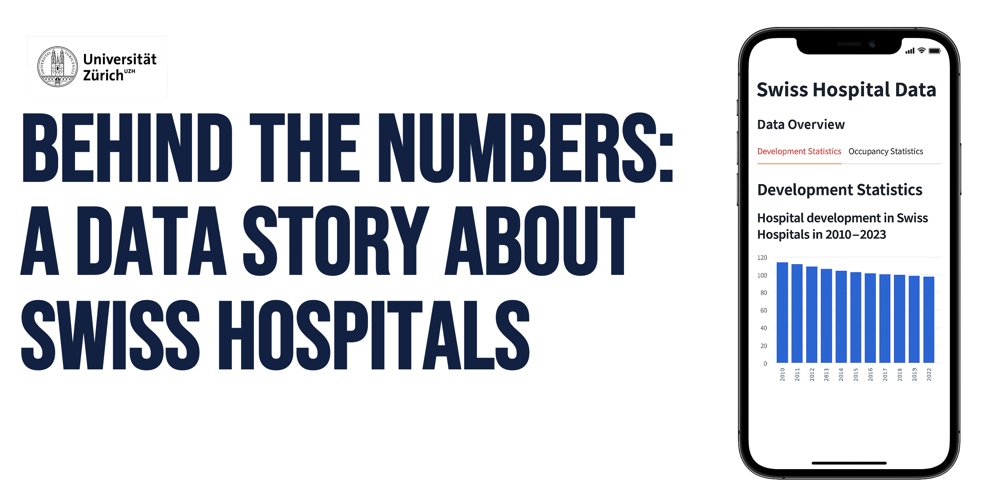
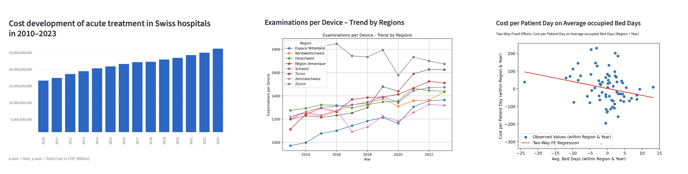
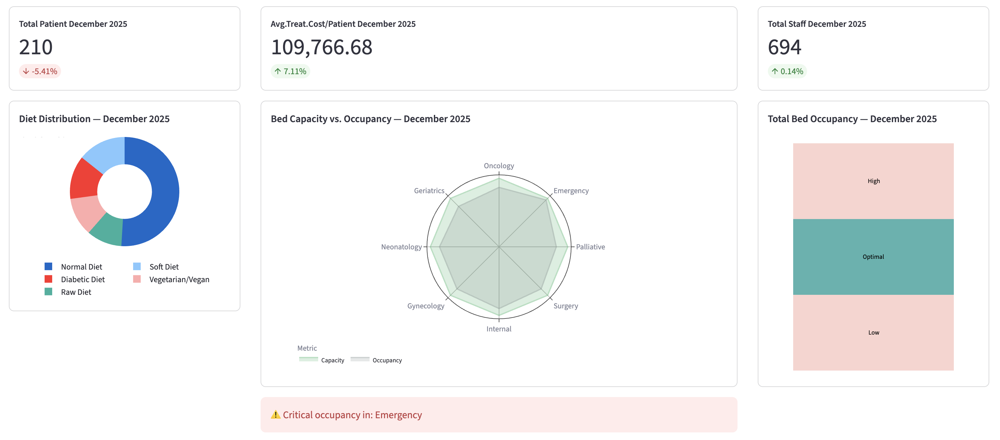

 

<h1> Introduction </h1>
Healthcare spending in Switzerland continues to grow – at a faster rate than in the past. According to the KOF, Swiss healthcare spending will reach almost CHF 110 billion in 2027.
An essential component of this healthcare system are hospitals, which account for annual costs of over CHF 25 billion.

In this project, we examined how this segment has developed and what measures could potentially help to save costs.

[Project Description](#project-description) I [Data Overview](#data-overview) I [Technical Overview](#technical-overview)

[Visit our Website!](https://final-project-jbns.streamlit.app)

<h1 id="project-description">Project Description</h1>
<h2> Switzerland’s healthcare landscape is changing: fewer hospitals, rising costs, and significant regional differences. </h2>
 

In the first part of our Project we explored the Swiss hospital landscape over a decade. We analysed data containing information to the infrastructure, the staff, the cost of Swiss hospitals and more.

Our analysis revealed valuable insights about capacities, efficiencies and the pressures shaping today's hospital system.

The guiding questions we were able to answer through our data analysis are:
<h4> - How have hospitals and beds changed? </h4>

The number of hospitals decreases over time, while the total number of beds declined more moderately. This points to consolidation of hospital sites with slightly higher bed capacity per remaining hospital.

<h4> - What drives rising hospital costs </h4>

Costs correlate strongly with higher staff expenses. Regression analysis showed that as the number of nursing staff per bed increases, the costs per patient day also increases.

<h4> - How do the regions differ structurally? </h4>

The regional comparison shows clear differences in examinations/device-rate and beds/staff-rate. Furthermore we visualize that regional differences exist in terms of costs per patient day despite the same nurse-to-bed ratio.

<h4> - What impact had the global pandemic in 2020? </h4>

In 2020, contrary to the overall trend, we are seeing a slight increase in hospital locations. We also have a high acquisition rate for medical equipment. The costs are in line with the upward trend.

[Visit Facts and Figures!](https://final-project-jbns.streamlit.app/Facts_and_Figures)

<h2> Discover how a figurative set of key indicators for Swiss hospitals could look like </h2>
 

Our analysis showed that costs are influenced by infrastructure, patients, utilisation, supply and much more. Much of this cannot be saved because it is central to our healthcare system. This makes it all the more important to save where possible and not to generate unnecessary costs due to inefficiencies or other factors.

For this reason, we designed a dashboard that provides a direct overview of the most important key figures and allows you to analyze trends is a great way to help avoid these costs.

The dashboard is based on fictitious data, but real data could easily be implemented to enable real conclusions to be drawn!

[Visit our Dashboard!](https://final-project-jbns.streamlit.app/Dashboard_for_Sample_Hospital)

<h1 id="data-overview">Data Overview</h1>
For our project, we used available datasets from the Federal Office of Public Health and the Federal Statistical Office. We used five datasets which we merged into one.

You can find the original Datasets under:

[Data regarding hospital costs (FOPH)](https://www.bag.admin.ch/de/kennzahlen-der-schweizer-spitaeler) 

[Data regarding hospital services (FSO)](https://www.pxweb.bfs.admin.ch/pxweb/de/px-x-1404010100_102/px-x-1404010100_102/px-x-1404010100_102.px/)

[Data regarding hospital staff (FSO)](https://www.pxweb.bfs.admin.ch/pxweb/de/px-x-1404010100_103/px-x-1404010100_103/px-x-1404010100_103.px/)

[Data regarding hospital infrastructure (FSO)](https://www.pxweb.bfs.admin.ch/pxweb/de/px-x-1404010100_101/px-x-1404010100_101/px-x-1404010100_101.px/)

Feel also free to look at our cleanded and merged dataset and make use of the filter option if you are interested in specific variables, regions or years. You can find it on the fourth tab of our Facts and Figures page.

[Visit the final Dataset!](https://final-project-jbns.streamlit.app/Facts_and_Figures)

<h1 id="technical-overview">Technical Overview</h1>
<h2> Data cleaning and merging</h2>
The data for our analysis was spread across various data sets. In order to merge them, we had to bring them into the same structure, using pandas.

Following Tidy Data we cleaned up each dataset, so that:
1. Each variable in its own column
2. Each observation (Region + Year) in its own row

By combining year and region as one observation unit, we were able to use those columns as identifiers for merging the dataset later.

To view the entire process, you can take a look at our [Jupyter Notebook](./scripts/hospital_costs_new.ipynb).

<h2> Data analysis and visualization</h2>
When analyzing and visualizing the data, we used libraries such as pyplot and scikit-learn.
This has enabled us to choose a wide variety of analysis and visualisation approaches in order to present the key messages as precisely and concisely as possible.

The files for data analysis and visualisation can be found [here](.app/pages). 

